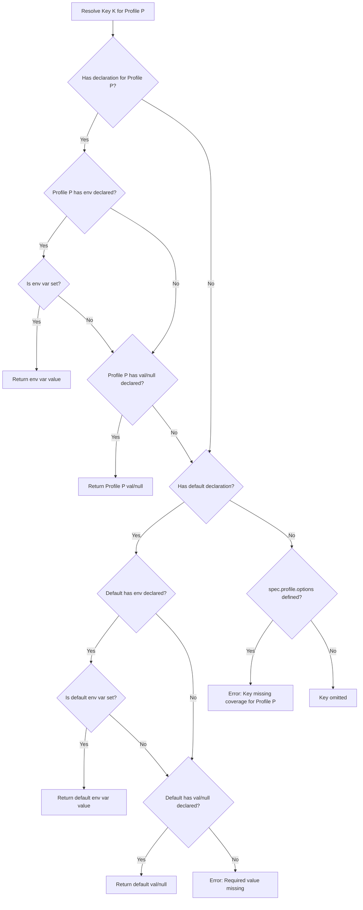
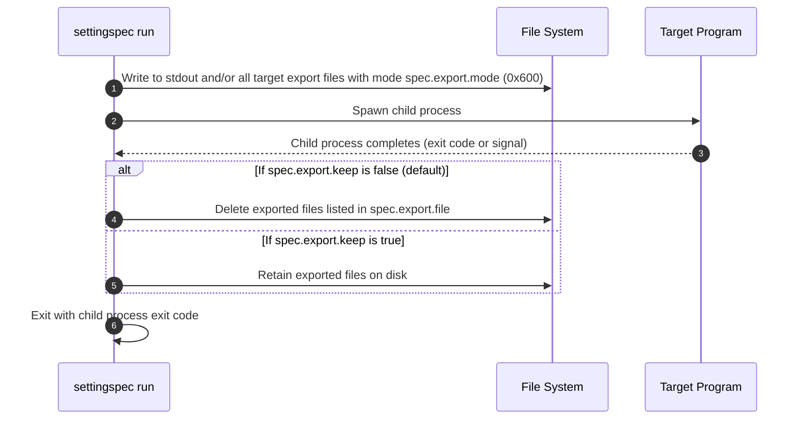

# SettingSpec Specification

**Version:** 0.1  
**Status:** Draft  
**Authors:** Arijit Basu and SettingSpec Contributors  
**Repository:** [https://github.com/sayanarijit/settingspec](https://github.com/sayanarijit/settingspec)

---

## 1. Overview and Goals

### 1.1 Purpose

Modern software development requires managing configuration across multiple environments (such as development, staging, testing, and production), various programming languages (such as Python, Node.js, Rust, Go, Lua), and nested modules. Traditional approaches frequently split configurations across multiple files (`common.toml`, `dev.toml`, `prod.toml`), leading to:

1. **Mental overhead:** Developers must mentally merge configurations and guess override precedence.
2. **Silent configuration drift:** Missing keys in production often remain undetected until deployment failure or runtime crashes.
3. **Language lock-in:** Configurations written for one language (e.g., Python config or YAML) require duplication or custom converters for other tools in polyglot projects.
4. **Secret handling friction:** Secrets are either inadvertently committed to source control or detached from configuration schemas altogether.

**SettingSpec** establishes a unified, single-source-of-truth configuration format (`settingspec.toml`). It provides declarative profile definitions, compile-time/load-time strict environment validation, language-agnostic export capabilities, and seamless secret sourcing.

### 1.2 Conformance and Key Words

The key words "MUST", "MUST NOT", "REQUIRED", "SHALL", "SHALL NOT", "SHOULD", "SHOULD NOT", "RECOMMENDED", "MAY", and "OPTIONAL" in this document are to be interpreted as described in [RFC 2119](https://datatracker.ietf.org/doc/html/rfc2119).

### 1.3 Terminology

- **Configuration File:** The primary TOML file declaring the specification and settings (by default `settingspec.toml`).
- **Profile:** A named runtime environment or operational context (e.g., `dev`, `stage`, `prod`).
- **Default Profile (`default`):** A fallback profile selector denoting settings applicable across all profiles unless explicitly overridden.
- **Setting Key:** A hierarchical dot-delimited identifier (e.g., `key1`, `database.host`, `group1.auth.timeout`).
- **Directive:** A terminal attribute defining the origin or property of a setting (`val`, `env`, `null`, `tags`).
- **Active Profile:** The single profile selected for the current execution context.
- **Export Target:** A file or standard output stream where resolved settings are serialized.

---

## 2. File Format and Document Structure

### 2.1 File Location and Syntax

1. A SettingSpec configuration MUST be a valid [TOML v1.0.0](https://toml.io/en/v1.0.0) document.
2. The configuration file name is `settingspec.toml`, located in the root of the project directory. There is no way to overwrite it.
3. A SettingSpec document consists of two top-level tables:
   - `[spec]`: Metadata, profile declarations, environment file sources, and export definitions (OPTIONAL).
   - `[settings]`: Setting definitions and per-profile value declarations (REQUIRED).

### 2.2 TOML Key Representations

SettingSpec uses dotted keys to represent hierarchical settings, target profiles, and directives.

```toml
[settings]
key1.default.val = "val1"
```

---

## 3. The `[spec]` Section

The `[spec]` section configures profile resolution, environment variable file loading, and export definitions.

```toml
[spec]
profile.key = "SETTINGSPEC_PROFILE"
profile.options = ["dev", "stage", "prod"]
profile.default = "dev"

envfile.default = ".env"
envfile.prod = "-"

[spec.export]
mode = 0x600
keep = false
stdout = "toml"

[spec.export.file]
"settings.toml" = true
"settings.json".group1 = true
```

### 3.1 Profile Configuration (`spec.profile`)

The `profile` sub-table configures active profile selection and validation rules:

| Field             | Type             | Default                 | Description                                                                         |
| ----------------- | ---------------- | ----------------------- | ----------------------------------------------------------------------------------- |
| `profile.key`     | String           | `"SETTINGSPEC_PROFILE"` | The name of the environment variable inspected to determine the active profile.     |
| `profile.options` | Array of Strings | `[]` (empty / unset)    | The closed list of valid profile names. Enables strict coverage validation.         |
| `profile.default` | String           | `None` (unset)          | Fallback profile to activate when the environment variable is not defined or empty. |

#### 3.1.1 Profile Validation Rules

- If `profile.options` is specified:
  1. The active profile MUST be an element of `profile.options`. If the resolved active profile is not in `profile.options`, execution MUST fail immediately with an error.
  2. Any profile name used within the `[settings]` table MUST either be an element of `profile.options` or the reserved identifier `default`. Any unknown profile name MUST cause configuration loading to fail.
  3. The reserved name `default` MUST NOT be included as an element in `profile.options`.
  4. **Strict Coverage Rule:** For every setting declared in `[settings]`, if a `default` declaration is absent, a declaration MUST exist for **every** profile listed in `profile.options`. If any profile is unmapped, loading MUST fail.

### 3.2 Environment Files (`spec.envfile`)

SettingSpec can load environment variable definition files (dotenv files) prior to resolving settings. This is declared under `spec.envfile`:

- `envfile.default`: Environment file loaded by default for all profiles.
- `envfile.<profile>`: Environment file loaded specifically when `<profile>` is active.

```toml
[spec]
envfile.default = ".env"
envfile.prod = "-"
```

#### 3.2.1 Sourcing Rules

1. If an environment file is specified for the active profile (`envfile.<profile>`), it takes precedence over `envfile.default`.
2. Sourcing occurs **before** setting values are resolved.
3. The special value `"-"` denotes reading environment variables in dotenv format (`KEY=VALUE`) from standard input (`stdin`).
4. Sourced environment variables populate the execution environment for the duration of setting resolution and child command execution.

### 3.3 Export Configuration (`spec.export`)

The `export` sub-table specifies how resolved settings are output to files or stdout.

#### 3.3.1 File Mode (`export.mode`)

- **Type:** Integer (POSIX permission bits).
- **Default:** `0x600` (octal `0600`, read/write by owner only).
- **Description:** All files created by `settingspec export` or `settingspec run` MUST be created or chmod-ed to this mode to protect configuration secrets against unauthorized local access.

#### 3.3.2 File Retention (`export.keep`)

- **Type:** Boolean.
- **Default:** `false`.
- **Description:** Controls whether exported target files are retained after `settingspec run` finishes execution.
  - When `false` (default), SettingSpec automatically cleans up and deletes all generated export files after the child command finishes execution.
  - When `true`, SettingSpec retains all exported files on disk after the child command finishes execution.

#### 3.3.3 Standard Output (`export.stdout`)

- **Type:** String (`"toml"`, `"json"`, `"yaml"`, `"env"` etc. supported formats).
- **Default:** None.
- **Description:** Emits the resolved settings directly to standard output in the specified serialization format.

#### 3.3.4 Target Files (`export.file`)

The `export.file` table maps target file paths to export filter expressions:

```toml
[spec.export.file]
"settings.toml" = true
"settings.yaml" = { key1 = true, group1 = true, group2.subgroup = true, group3.subgroup = false, "#tag1" = true }
```

- If both `export.stdout` and `export.file` are omitted from `[spec]`, the default behavior MUST be:
  ```toml
  [spec.export.file]
  "settings.toml" = true
  ```

---

## 4. The `[settings]` Section

The `[settings]` section defines configuration keys, their values, environment bindings, tags, and profile-specific overrides.

### 4.1 Declaration Grammar

Each declaration in `[settings]` follows the canonical syntax:

```
{key}.{profile}.{directive} = {value}
```

Where:

- `{key}`: A dot-delimited identifier representing the setting name or namespace path (e.g., `key1`, `database.host`, `app.server.port`).
- `{profile}`: A valid profile name defined in `spec.profile.options` or the reserved identifier `default`.
- `{directive}`: One of the reserved terminal keywords: `val`, `env`, `null`, or `tags`.
- `{value}`: The directive value.

Because TOML treats dot-delimited keys as table hierarchies, the declaration parser identifies:

1. The **terminal segment** as the directive (`val`, `env`, `null`, or `tags`).
2. The **penultimate segment** as the profile identifier (`default` or profile name).
3. All **preceding segments** as the hierarchical setting key path.

### 4.2 Setting Directives

#### 4.2.1 `val`

Supplies a static, literal value for the setting.

- **Supported Types:** String, Integer, Float, Boolean, Datetime (RFC 3339), Array, Inline Table.
- **Example:**
  ```toml
  app.name.default.val = "MyApp"
  app.port.dev.val = 8080
  app.port.prod.val = 80
  ```

#### 4.2.2 `env`

Binds the setting to an environment variable name.

- **Type:** String (the name of an environment variable).
- **Semantics:** At resolution time, SettingSpec attempts to read the named environment variable from the runtime environment (including variables loaded via `spec.envfile`).
- **Example:**
  ```toml
  database.password.default.env = "DB_PASSWORD"
  ```

#### 4.2.3 Coexistence of `val/null` and `env` (Default with Env Override)

A setting profile declaration MAY specify both `val/null` and `env`. In such cases, the following resolution rules apply:

```toml
secret2.default.val = "defaultvalue"
secret2.default.env = "SECRET2"
secret2.prod.env = "PRODSECRET"
```

- If the environment variable specified by `env` exists, its value MUST be used.
- If the environment variable does not exist, the value specified by `val/null` MUST be used as the fallback default.
- If a setting has an `env` directive without a `val` or `null` directive, and the environment variable is absent at runtime, resolution MUST fail with a missing variable error.

#### 4.2.4 `null`

Explicitly declares that a setting has a null or unset value for the specified profile.

- **Type:** Boolean (`true`).
- **Example:**
  ```toml
  debug_banner.default.val = "My App BETA 0.0.1"
  debug_banner.prod.null = true
  ```
- **Target Export Semantics:**
  - For formats with native null representations (JSON, YAML, Python `None`, Lua `nil`), the setting MUST be exported as null/None/nil.
  - For formats without native null representations (TOML 1.0, shell `.env`), the setting key MUST be omitted from the exported target.
  - `null` can only be `true` and cannot co-exist with `val` for the same profile declaration. If both are present, configuration loading MUST fail.

#### 4.2.5 `tags`

Associates a list of string tags with a setting.

- **Type:** Array of Strings.
- **Example:**
  ```toml
  api_key.default.tags = ["sensitive", "auth"]
  ```
- **Semantics:** Tags are metadata and are NOT exported as values of the setting. They are used by export filters to include or exclude tagged settings (e.g., `#auth`).

---

## 5. Resolution and Validation Semantics

### 5.1 Active Profile Resolution Order

When executing SettingSpec, the active profile MUST be determined using the following precedence (highest priority first):

1. **Environment Variable:** The value of the environment variable specified by `spec.profile.key` (default: `SETTINGSPEC_PROFILE`).
2. **Specification Default:** The value specified by `spec.profile.default`.
3. **Resolution Failure:** If none of the above are set:
   - If `spec.profile.options` is defined, execution MUST terminate with an error stating that no profile was selected.
   - If `spec.profile.options` is not defined, execution MAY continue using default-only resolution.

### 5.2 Setting Resolution Precedence

For a given setting key `K` and active profile `P`, the resolved value `V(K, P)` MUST be resolved using the following order:



### 5.3 Static Validation Rules

During initialization, SettingSpec MUST validate the configuration document prior to performing any export or execution:

1. **Option Membership:** If `spec.profile.options` is set, every profile referenced in `[settings]` MUST be present in `spec.profile.options` or be `default`.
2. **Exhaustive Profile Coverage:** If `spec.profile.options` is set, every setting key `K` defined in `[settings]` MUST satisfy at least one of:
   - A `default` declaration exists for `K`.
   - An explicit declaration exists for `K` across **all** profiles listed in `spec.profile.options`.
3. **Directive Validity:** A declaration MUST contain `env` or at least one of `val` or `null = true`, along with optional `tags`. Unknown directives MUST be rejected with an error.

---

## 6. Export Target Filtering and Generation

### 6.1 Filter Expressions and Types

Export target specifications under `spec.export.file` select subsets of resolved settings for each target file. SettingSpec supports two filter representations:

#### 6.1.1 Boolean Filter (`true` / `false`)

- **`true`:** Exports all resolved settings into the target file.
- **`false`:** Disables exporting to this target file (no file is created).

```toml
[spec.export.file]
"settings.toml" = true
```

#### 6.1.2 Table Filter (Fine-Grained Selector Map)

When finer control over inclusion and exclusion is required, an export target can be defined as an inline table or sub-table mapping selectors (exact keys, namespace prefix paths, or tags) to boolean values (`true` to include, `false` to exclude):

```toml
[spec.export.file]
"settings.yaml" = { key1 = true, group1 = true, group2.subgroup = true, group3.subgroup = false, "#tag1" = true }
```

Or using standard TOML table syntax:

```toml
[spec.export.file."settings.yaml"]
key1 = true
group1 = true
group2.subgroup = true
group3.subgroup = false
"#tag1" = true
```

Exclusion rules take precedence over inclusion rules.

### 6.2 Table Filter Semantics and Resolution Rules

In a table filter, each key is a selector (exact key, group path, or tag) and each value is a boolean flag (`true` or `false`).

#### 6.2.1 TOML Syntax and Non-Conflicting Rules

SettingSpec configurations MUST be valid TOML v1.0.0 documents. In TOML:

1. **No scalar/table conflicts:** A key cannot be assigned a scalar value and subsequently reopened as a table. Syntax such as:
   ```toml
   # INVALID TOML: Fails with parse error
   group2 = true
   group2.subgroup = false
   ```
   is syntactically invalid because `group2` cannot simultaneously be a boolean scalar and a table containing `subgroup`.
2. **No duplicate keys:** Defining duplicate keys in the same scope (e.g., `key = true` and `key = false`) is forbidden by TOML.

Consequently, table filters do NOT allow or require conflicting hierarchical rules on the exact same key path. Instead, SettingSpec interprets scoped rules hierarchically.

#### 6.2.2 Filter Evaluation and Precedence Rules

SettingSpec MUST evaluate table filters using the following precedence and scoping rules:

1. **Exclusion Preferred Over Inclusion:**
   Exclusion (`false`) always takes precedence over inclusion (`true`). If a setting matches an applicable exclusion rule (whether by exact key, namespace prefix, or tag), it MUST NOT be exported, even if it also matches an inclusion rule.

2. **Group and Subgroup Inclusion (`= true`):**
   Setting a group or subgroup selector to `true` includes all settings under that namespace:
   - If `group1 = true`, all settings under `group1` (e.g., `group1.key1`, `group1.sub.key2`) are included.
   - If `group1.subgroup1 = true`, all settings under `group1.subgroup1` (e.g., `group1.subgroup1.key1`) are included.

3. **Exact Key Inclusion (`= true`):**
   Setting an individual key to `true` (e.g., `key1 = true` or `group2.subgroup2.key = true`) includes only that specific setting:
   - If `group2.subgroup2.key = true`, only `group2.subgroup2.key` is included. Sibling keys within `group2.subgroup2` are NOT included unless explicitly selected.

4. **Implicit Parent Inclusion via Child Exclusion (`= false`):**
   Because TOML syntax does not permit writing `group = true` alongside `group.subgroup = false`, setting a child path or key to `false` in the absence of sibling inclusion rules implicitly includes the enclosing parent namespace while excluding that specified child:
   - If `group3.subgroup = false`, all settings from `group3` are included, **excluding** those under `group3.subgroup`.
   - If `group2.subgroup2.key = false` (or `group1.subgroup2.key = false`), all settings from the parent namespace are included, **excluding** `group2.subgroup2.key`.

5. **Mixed Inclusion and Exclusion in the Same Scope:**
   If a namespace specifies both inclusion (`true`) and exclusion (`false`) rules:
   - For example, if `group2.subgroup2.key1 = true` and `group2.subgroup2.key2 = false`:
     - Only `group2.subgroup2.key1` is included.
     - `group2.subgroup2.key2` is explicitly excluded.
     - Unmentioned sibling keys (e.g., `group2.subgroup2.key3`) are NOT included. Explicit inclusion rules (`key1 = true`) establish the candidate set for that scope, so the presence of an exclusion rule (`key2 = false`) does not implicitly include unselected siblings. Exclusion is preferred over inclusion.

6. **Tag Selectors (`"#tag"`):**
   Tag selectors cross-cut hierarchy:
   - If `"#tag1" = true`, any setting declaring `tags = ["tag1"]` is included (unless excluded by an exclusion rule).
   - If `"#tag2" = false`, any setting declaring `tags = ["tag2"]` is excluded, even if its parent group was set to `true`.

7. **Base Inclusion Scope:**
   - **Explicit Inclusion Mode:** If the table filter contains one or more inclusion rules (or implicit parent inclusions from child exclusion rules), only settings matching those inclusions are considered candidates for export. Settings in other unmentioned namespaces are excluded.
   - **Pure Exclusion Mode:** If the table filter contains **only** top-level exclusion rules (e.g., `group1 = false`, `"#draft" = false`), all resolved settings are candidates by default, except those matching any exclusion rule.

#### 6.2.3 Summary of Filter Patterns

| Pattern                | Example                                                           | Resolved Behavior                                                |
| ---------------------- | ----------------------------------------------------------------- | ---------------------------------------------------------------- |
| Group Inclusion        | `group1 = true`                                                   | Include all settings from `group1`.                              |
| Subgroup Inclusion     | `group1.subgroup1 = true`                                         | Include all settings from `group1.subgroup1`.                    |
| Exact Key Inclusion    | `group2.subgroup2.key = true`                                     | Include only `group2.subgroup2.key`.                             |
| Subgroup Exclusion     | `group3.subgroup = false`                                         | Include all from `group3` except `group3.subgroup`.              |
| Key Exclusion          | `group2.subgroup2.key = false`                                    | Include all from parent namespace except `group2.subgroup2.key`. |
| Mixed in Same Scope    | `group2.subgroup2.key1 = true`<br>`group2.subgroup2.key2 = false` | Include only `group2.subgroup2.key1`.                            |
| Tag Exclusion Override | `group1 = true`<br>`"#sensitive" = false`                         | Include all from `group1` except settings tagged `#sensitive`.   |

### 6.3 Supported File Formats and Code Generators

Export formats are inferred from the destination file extension:

| Extension       | Format            | Description                                                                               |
| --------------- | ----------------- | ----------------------------------------------------------------------------------------- |
| `.toml`         | TOML 1.0          | Standard TOML format. Keys with `null` values are omitted.                                |
| `.json`         | JSON              | Standard JSON. Keys with `null` values are serialized as `null`.                          |
| `.yaml`, `.yml` | YAML              | Standard YAML. Keys with `null` values are serialized as `null` or `~`.                   |
| `.py`           | Python Module     | Python source file defining nested classes or top-level variables. `null` maps to `None`. |
| `.js`, `.mjs`   | JavaScript Module | ECMAScript module (`export default { ... }`). `null` maps to `null`.                      |
| `.ts`           | TypeScript Module | TypeScript module with typed interfaces and `export default { ... }`.                     |
| `.lua`          | Lua Table         | Lua module returning a table (`return { ... }`). `null` maps to `nil`.                    |

---

## 7. Command-Line Interface (CLI) Specification

SettingSpec provides a unified command-line tool named `settingspec`.

### 7.1 Common Options

All subcommands accept the following common options:

- `-h, --help`: Print help information.
- `-V, --version`: Print version information.

### 7.2 Subcommand: `export`

Generates all configured export files and/or writes formatted output to stdout.

```bash
settingspec export [OPTIONS]
```

### 7.3 Subcommand: `run`

Executes a command with resolved configuration available as exported files.

```bash
settingspec run [OPTIONS] -- <COMMAND> [ARGS...]
```

#### 7.3.1 Execution Lifecycle



1. **File Generation:** SettingSpec resolves settings for the active profile and writes all target export files declared in `spec.export.file` using permission mode `spec.export.mode` (default `0x600`).
2. **Execution:** The child process `<COMMAND> [ARGS...]` is spawned. Signals (e.g., `SIGINT`, `SIGTERM`) MUST be forwarded to the child process.
3. **Cleanup:**
   - If `spec.export.keep` is `false` (default): All exported target files are deleted upon completion.
   - If `spec.export.keep` is `true`: Exported target files are retained on disk.
4. **Exit Code Propagation:** SettingSpec MUST exit with the same exit status code as the child process.

### 7.4 Subcommand: `check`

Validates configuration syntax, profile completeness, and environment variable requirements without writing any files to disk.

```bash
settingspec check [OPTIONS]
```

- Returns exit code `0` on validation success.
- Returns non-zero exit code with diagnostic errors if syntax is invalid, profiles are incomplete, or required environment variables are missing.

---

## 8. Security Considerations

1. **File Permission Enforcement:** All generated export files containing configuration or secrets MUST be created with restricted file permissions (`spec.export.mode`, default `0x600`). On POSIX systems, this prevents reading by other unprivileged users on the same host.
2. **Ephemeral Secrets:** Applications that utilize `settingspec run` benefit from ephemeral file lifetimes. By default (`spec.export.keep = false`), SettingSpec guarantees cleanup of exported files upon process exit, even in the event of child errors or termination signals.
3. **Source Control Hygiene:** Configuration authors SHOULD add generated targets (e.g., `settings.toml`, `settings.json` etc.) to `.gitignore` to prevent inadvertent commits of decrypted secrets.
4. **Standard Input for Secrets:** When pairing with secret managers (e.g., SecretSpec, 1Password CLI, Vault), users SHOULD pass secrets via environment variables or stdin (`envfile.prod = "-"`) to avoid writing raw secrets to persistent disk.
