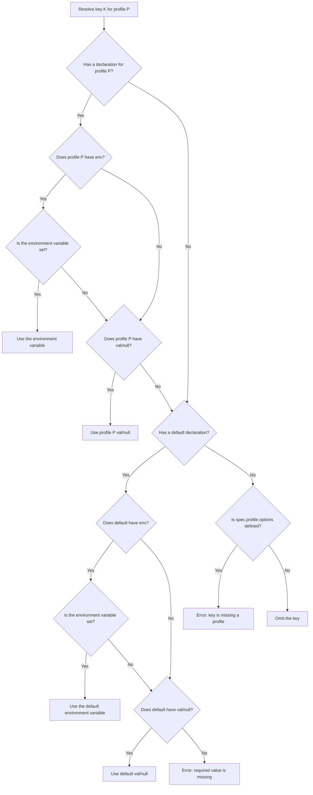

# SettingSpec Specification

**Version:** 0.5  
**Status:** Released  
**Authors:** Arijit Basu and SettingSpec Contributors  
**Repository:** <https://github.com/sayanarijit/settingspec>

---

## 1. Overview

### 1.1 What SettingSpec does

Modern projects often need different configuration for development, staging, testing, and production. They may also use several programming languages and nested modules.

A common approach is to keep separate files such as `common.toml`, `dev.toml`, and `prod.toml`. This creates several problems:

1. **Hard to understand:** Developers must combine several files mentally and work out which value wins.
2. **Configuration drift:** A setting may be missing in production and the problem may not be noticed until deployment or runtime.
3. **Language-specific configuration:** A configuration written for one language may need to be duplicated or converted for another.
4. **Secrets are awkward to manage:** Secrets may accidentally be committed to source control or kept separate from the configuration rules.

**SettingSpec** uses one configuration file, `settingspec.toml`, as the source of truth.

It provides:

- Named profiles such as `dev`, `stage`, and `prod`.
- Strict validation of profiles and required settings.
- Values from environment variables.
- Export to several file formats and programming languages.
- Support for environment files, including age-encrypted files.
- Temporary generated configuration files when running a command.

### 1.2 Required words

The words **MUST**, **MUST NOT**, **REQUIRED**, **SHALL**, **SHALL NOT**, **SHOULD**, **SHOULD NOT**, **RECOMMENDED**, **MAY**, and **OPTIONAL** have the meanings defined by RFC 2119.

### 1.3 Terms

- **Configuration file:** The main TOML file: `settingspec.toml`.
- **Profile:** A named environment or operating mode, such as `dev`, `stage`, or `prod`.
- **Default profile:** The `default` profile. It provides values that apply to all profiles unless a profile overrides them.
- **Setting key:** A setting name that can contain dot-separated parts, such as `database.host`.
- **Directive:** The final part of a setting declaration. Supported directives are `val`, `env`, `null`, and `tags`.
- **Active profile:** The profile selected for the current run.
- **Export target:** A file or standard output where resolved settings are written.

---

## 2. Configuration File

### 2.1 File name and location

A SettingSpec configuration:

1. MUST be valid TOML 1.0.
2. Is stored as `settingspec.toml` in the project root.
3. If it is not found in the current directory, SettingSpec searches parent directories until it finds the file. That directory becomes the project root.

The file has two top-level sections:

- `[spec]` — optional. Controls profiles, environment files, decryption keys, and exports.
- `[settings]` — required. Defines the actual settings and their values.

### 2.2 Setting names

SettingSpec uses dot-separated keys to represent settings, profiles, and directives.

```toml
[settings]
key1.default.val = "val1"
```

The general form is:

```text
{key}.{profile}.{directive} = {value}
```

---

## 3. The `[spec]` Section

The `[spec]` section controls:

- Which profile is active.
- Which environment files are loaded.
- How encrypted environment files are decrypted.
- Where resolved settings are exported.

Example:

```toml
[spec]
profile.key = "SETTINGSPEC_PROFILE"
profile.options = ["dev", "stage", "prod"]
profile.default = "dev"

envfile.default = ".env"
envfile.stage = ".env.age"
envfile.prod = "-"

decryption.key.env = "SETTINGSPEC_DECRYPTION_KEY"
decryption.key.path = "~/.ssh/"

[spec.export]
mode = 0x600
keep = false
stdout = "toml"

[spec.export.file]
"settings.toml" = true
"settings.json".group1 = true
```

### 3.1 Profiles

The profile settings control how SettingSpec chooses and validates the active profile.

| Setting           | Type             | Default               | Meaning                                                   |
| ----------------- | ---------------- | --------------------- | --------------------------------------------------------- |
| `profile.key`     | String           | `SETTINGSPEC_PROFILE` | Environment variable used to select the active profile.   |
| `profile.options` | Array of strings | Empty                 | List of allowed profile names.                            |
| `profile.default` | String           | Unset                 | Profile to use when `profile.key` is not set or is empty. |

#### Profile validation

When `profile.options` is set:

1. The active profile MUST be in the list.
2. Every profile used in `[settings]` MUST be in the list or be `default`.
3. `default` MUST NOT be included in `profile.options`.
4. Every setting MUST either have a `default` declaration or have a declaration for every profile in `profile.options`.
5. Profile names MUST NOT be `val`, `env`, `null`, or `tags`.

If any of these rules fail, configuration loading MUST stop with an error.

### 3.2 Environment files

SettingSpec can load dotenv-style environment files before resolving settings.

```toml
[spec]
envfile.default = ".env"
envfile.stage = ".env.age"
envfile.prod = "-"
```

- `envfile.default` is used when the active profile has no specific environment file.
- `envfile.<profile>` is used for a specific profile.
- `-` means read dotenv content from standard input (`stdin`).

Environment files including the piped standard input may be age-encrypted.

#### Loading rules

1. If the active profile has its own `envfile.<profile>`, SettingSpec loads that file.
2. If that file is declared but missing, SettingSpec MUST stop with an error. It MUST NOT fall back to `envfile.default`.
3. A profile-specific environment file replaces the default one; the two files are not merged.
4. If no profile-specific file is declared, `envfile.default` is used.
5. Environment files are loaded before settings are resolved.
6. Loaded variables are available while resolving settings and when running the child command.
7. Age-encrypted files are decrypted before the dotenv content is read.
8. Input from `stdin` may also be age-encrypted and follows the same decryption rules.

### 3.2.1 Age-encrypted environment files

SettingSpec supports age-encrypted environment files so encrypted secrets can be stored alongside `settingspec.toml`.

A file is treated as age-encrypted when:

- Its name ends in `.age`, or
- Its contents use the age binary or armored format:
  `-----BEGIN AGE ENCRYPTED FILE-----`

Decryption keys are configured with:

```toml
[spec]
decryption.key.env = "SETTINGSPEC_DECRYPTION_KEY"
decryption.key.path = "~/.ssh/"
```

| Setting               | Type            | Default                      | Meaning                                                             |
| --------------------- | --------------- | ---------------------------- | ------------------------------------------------------------------- |
| `decryption.key.env`  | String          | `SETTINGSPEC_DECRYPTION_KEY` | Environment variable containing a decryption identity or key paths. |
| `decryption.key.path` | String or array | Unset                        | Fallback file or directory paths containing age identities.         |

A path can point to either a file or a directory. Directories are searched recursively for supported age identity files.

Passphrase-protected identity files are not supported.

#### Decryption key order

SettingSpec looks for a decryption identity in this order:

1. Read the environment variable named by `decryption.key.env`.
2. If it is empty or missing, search the paths in `decryption.key.path`.
3. If no identity can decrypt the file, SettingSpec MUST stop with an error identifying the affected profile and file.

The value of `decryption.key.env` must be either:

- One literal age identity, such as `AGE-SECRET-KEY-1...`, or
- One or more paths separated by `:`.

Example:

```text
~/.age/keys:/etc/settingspec/keys
```

If a supplied path is a file, that file is checked directly. If it is a directory, the directory is searched recursively.

SettingSpec tries candidate identities in the order found and uses the first one that successfully decrypts the file.

### 3.3 Export settings

The `spec.export` section controls how resolved settings are written.

#### `export.mode`

- Type: Integer containing POSIX file permissions.
- Default: `0x600` (`0600`).
- All files created by `settingspec export` or `settingspec run` MUST use this mode.

The default allows only the file owner to read and write the file.

#### `export.keep`

- Type: Boolean.
- Default: `false`.

When `false`, generated files are deleted after `settingspec run` finishes.

When `true`, generated files remain on disk.

#### `export.stdout`

- Type: Boolean or format name.
- Default: Disabled.

```toml
export.stdout = true
```

or

```toml
export.stdout = "json"
```

`true` or `""` means TOML. A format name such as `json`, `yaml`, `toml`, or `env` selects that format.

#### `export.file`

Defines the files to generate.

```toml
[spec.export.file]
"settings.toml" = true
"settings.yaml" = { key1 = true, group1 = true, "#tag1" = true }
```

If no export configuration is given, the default is:

```toml
[spec.export.file]
"settings.toml" = true
```

`true` exports all settings. `false` disables that target.

Environment-style files such as `.env` and `*.env` use `env` format.

An unknown output format MUST cause an error.

#### `export.env`

Exports resolved settings as environment variables for the child process started by `settingspec run`.

```toml
export.env = true
```

Converts:

```text
database.host
```

to:

```text
DATABASE_HOST
```

A prefix can also be supplied:

```toml
export.env = "PREFIX_"
```

This produces:

```text
PREFIX_DATABASE_HOST
```

`false` or omission disables this behavior.

Settings with `null` values are not exported as environment variables.

#### `export.stdin`

Passes resolved settings to the child process through standard input.

```toml
export.stdin = true
```

uses TOML. A format name can be used instead:

```toml
export.stdin = "json"
```

`false` or omission disables this behavior.

#### `export.skip_gitignore`

By default, when running inside a Git repository, SettingSpec adds generated export files to `.gitignore` if they are not already listed.

```toml
spec.export.skip_gitignore = true
```

disables this automatic behavior.

---

## 4. The `[settings]` Section

The `[settings]` section defines setting values, environment variables, tags, and profile-specific overrides.

### 4.1 Declaration format

Each setting uses this form:

```text
{key}.{profile}.{directive} = {value}
```

For example:

```toml
app.name.default.val = "MyApp"
app.port.dev.val = 8080
app.port.prod.val = 80
```

The three parts are:

- `{key}` — the setting name, such as `database.host`.
- `{profile}` — a profile from `profile.options`, or `default`.
- `{directive}` — `val`, `env`, `null`, or `tags`.
- `{value}` — the value for that directive.

SettingSpec reads a dotted declaration by position:

1. The last part is the directive.
2. The part before it is the profile.
3. Everything before those two parts is the setting key.

### 4.1.1 Reserved names

The names `val`, `env`, `null`, and `tags` are reserved.

They MUST NOT be used:

- In any part of a setting key.
- As a profile name.

For example, these are invalid:

```toml
env.default.val = "x"
group1.tags.prod.val = "y"
val.default.env = "Z"
```

This rule prevents dotted names from being interpreted incorrectly.

SettingSpec MUST reject these conflicts during configuration validation and report the offending name.

### 4.2 Directives

#### `val`

Provides a fixed value.

Supported values include:

- String
- Integer
- Float
- Boolean
- RFC 3339 datetime
- Array
- Inline table

Example:

```toml
app.name.default.val = "MyApp"
app.port.dev.val = 8080
app.port.prod.val = 80
```

#### `env`

Gets the value from an environment variable.

```toml
database.password.default.env = "DB_PASSWORD"
```

SettingSpec reads `DB_PASSWORD` when the setting is resolved. This includes variables loaded from `spec.envfile`.

#### Using `val` or `null` with `env`

A setting can provide an environment variable plus a fallback value:

```toml
secret2.default.val = "defaultvalue"
secret2.default.env = "SECRET2"
secret2.prod.env = "PRODSECRET"
```

The rules are:

1. If the environment variable exists, use it.
2. If it does not exist, use the `val` or `null` fallback.
3. If there is an `env` directive but no `val` or `null`, and the environment variable is missing, resolution MUST fail.

#### `null`

Marks a setting as unset for a profile.

```toml
debug_banner.default.val = "My App BETA 0.0.1"
debug_banner.prod.null = true
```

When exported:

- JSON, YAML, Python, and Lua use their native null value.
- TOML and `.env` omit the setting.
- `null` can only be `true`.
- `null` cannot be used together with `val` for the same profile.

#### `tags`

Adds metadata tags to a setting.

```toml
api_key.default.tags = ["sensitive", "auth"]
```

Tags are not exported as setting values. They can be used when selecting settings for an export, for example with `#auth`.

---

## 5. Resolving and Validating Settings

### 5.1 Choosing the active profile

SettingSpec chooses the active profile in this order:

1. The environment variable named by `spec.profile.key` (default: `SETTINGSPEC_PROFILE`).
2. `spec.profile.default`.
3. If neither is set:
   - If `profile.options` exists, SettingSpec MUST stop with an error because no profile was selected.
   - Otherwise, SettingSpec MAY continue using default-only resolution.

### 5.2 Choosing a setting value

For a setting `K` and active profile `P`, SettingSpec follows this flow:



For the same rules in numbered form:

1. If `K` has a declaration for `P`:
   - If its `env` variable exists, use that value.
   - Otherwise, use its `val` or `null` value if one exists.
2. If there is no declaration for `P`, check `default`:
   - If the default `env` variable exists, use it.
   - Otherwise, use the default `val` or `null` value.
3. If no default exists:
   - With `profile.options`, this is a profile-coverage error.
   - Without `profile.options`, the key is omitted.

The flow above assumes that the setting key, profile, and directive have already been identified correctly. Reserved names such as `val`, `env`, `null`, and `tags` must be rejected during validation.

Environment files and their decryption are completed before this process starts, so their variables are available during resolution.

### 5.3 Validation before running

SettingSpec MUST validate the configuration before exporting or executing anything.

It checks that:

1. Every profile is declared in settings belong to the options declared in spec.
2. Every setting has complete profile coverage when strict profile validation is enabled.
3. Every declaration uses valid directives.
4. No setting key or profile name uses a reserved directive name.
5. Envionment values for the active profile are present if required.

---

## 6. Selecting Settings for Export

The `spec.export.file` section can export all settings or only selected settings.

### 6.1 Simple filters

```toml
[spec.export.file]
"settings.toml" = true  # same as spec.export.file = true
```

- `true` — export all resolved settings.
- `false` — do not create that file.

### 6.2 Detailed filters

A file can select specific keys, groups, or tags:

```toml
[spec.export.file]
"settings.yaml" = {
  key1 = true,
  group1 = true,
  group2.subgroup = true,
  group3.subgroup.key1 = false,
  "#tag1" = true
}
```

The same can be written as a TOML table:

```toml
[spec.export.file."settings.yaml"]
key1 = true
group1 = true
group2.subgroup = true
group3.subgroup.key1 = false
"#tag1" = true
```

### 6.2.1 TOML rules

TOML does not allow a name to be both a scalar and a table.

This is invalid:

```toml
# Invalid TOML
group2 = true
group2.subgroup = false
```

TOML also does not allow duplicate keys in the same scope.

SettingSpec therefore applies filter rules hierarchically instead of allowing conflicting definitions of the same TOML path.

### 6.2.2 Filter rules

#### Exclusions always win

A `false` rule always overrides a matching `true` rule.

If a setting matches an exclusion, it is not exported.

#### Include a group

```toml
group1 = true
```

Includes everything under `group1`, including nested settings.

#### Include a subgroup

```toml
group1.subgroup1 = true
```

Includes everything under that subgroup.

#### Include one exact key

```toml
group2.subgroup2.key = true
```

Includes only that key. Sibling keys are not included unless selected separately.

#### Exclude part of a group

```toml
group3.subgroup = false
```

This means: include the parent group, except for `group3.subgroup`.

Likewise:

```toml
group2.subgroup2.key = false
```

excludes that key from all its parent namespaces.

#### Mix inclusion and exclusion

```toml
group2.subgroup2.key1 = true
group2.subgroup2.key2 = false
```

Only `key1` is included. `key2` is excluded, and unmentioned sibling keys are not included.

#### Select by tag

```toml
"#tag1" = true
```

includes settings with the `tag1` tag.

```toml
"#tag2" = false
```

excludes settings with the `tag2` tag, even if their parent group is included.

#### Explicit and exclusion-only filters

If a filter contains an inclusion rule, only matching settings are candidates for export.

If a filter contains only top-level exclusions, all settings are candidates except those excluded.

### 6.3 Filter examples

| Pattern            | Example                                 | Result                                        |
| ------------------ | --------------------------------------- | --------------------------------------------- |
| Group inclusion    | `group1 = true`                         | Include everything under `group1`.            |
| Subgroup inclusion | `group1.subgroup1 = true`               | Include everything under that subgroup.       |
| Exact key          | `group2.subgroup2.key = true`           | Include only that key.                        |
| Subgroup exclusion | `group3.subgroup = false`               | Include `group3` except that subgroup.        |
| Key exclusion      | `group2.subgroup2.key = false`          | Include the parent namespace except that key. |
| Mixed rules        | `key1 = true`, `key2 = false`           | Include `key1` only.                          |
| Tag exclusion      | `group1 = true`, `"#sensitive" = false` | Include `group1` except sensitive settings.   |

### 6.4 Export formats

SettingSpec determines the output format from the destination file extension.

| Extension                          | Format            | Null handling               |
| ---------------------------------- | ----------------- | --------------------------- |
| `.toml`                            | TOML 1.0          | Null settings are omitted.  |
| `.json`                            | JSON              | Null becomes `null`.        |
| `.yaml`, `.yml`                    | YAML              | Null becomes `null` or `~`. |
| `.py`                              | Python module     | Null becomes `None`.        |
| `.js`, `.mjs`                      | JavaScript module | Null becomes `null`.        |
| `.ts`                              | TypeScript module | Null becomes `null`.        |
| `.lua`                             | Lua table         | Null becomes `nil`.         |
| `.env`, `.env.*`, `env.*`, `*.env` | Shell environment | Null settings are omitted.  |

---

## 7. Command-Line Interface

SettingSpec provides a command-line program named `settingspec`.

### 7.1 Common options

All commands support:

```text
-h, --help       Show help.
-V, --version    Show the version.
```

### 7.2 `export`

Generates the configured export files and/or writes resolved settings to standard output.

```bash
settingspec export [OPTIONS]
```

### 7.3 `run`

Runs another command with the resolved configuration available to it.

```bash
settingspec run [OPTIONS] -- <COMMAND> [ARGS...]
```

#### What happens during `run`

1. SettingSpec resolves the active profile and settings.
2. It creates the configured export files using `spec.export.mode` (default `0x600`).
3. It starts the requested command.
4. If configured, environment variables are provided to the child process.
5. If configured, resolved settings are sent to the child's standard input.
6. Signals such as `SIGINT` and `SIGTERM` are forwarded to the child process.
7. When the child finishes:
   - With `export.keep = false` (default), generated files are deleted.
   - With `export.keep = true`, generated files remain.
8. SettingSpec exits with the same status code as the child command.

### 7.4 `check`

Checks the configuration without creating files.

```bash
settingspec check [OPTIONS]
```

It checks:

- TOML syntax.
- Reserved keywords in setting names and profiles.
- Profile completeness.
- Required environment variables for active profile.
- Decryption identities for encrypted environment files used by the active profile.

Exit codes:

- `0` — validation passed.
- Non-zero — validation failed.

### 7.5 `watch`

Runs SettingSpec as a long-running service and regenerates the configured export files whenever `settingspec.toml` changes.

```bash
settingspec watch [OPTIONS]
```

### 7.6 `init`

Creates a starter `settingspec.toml` in the current directory.

```bash
settingspec init [OPTIONS]
```

If `settingspec.toml` already exists, `init` does nothing and does not overwrite it.

---

## 8. Security

### 8.1 Restrict generated files

Generated configuration files use `spec.export.mode`, which defaults to `0600`.

On POSIX systems, this prevents other unprivileged users on the same machine from reading the files.

### 8.2 Remove temporary secrets

By default, `settingspec run` deletes generated export files when the child process finishes, including when the child fails or is terminated by a signal.

### 8.3 Keep generated files out of Git

Generated files can contain secrets. They SHOULD be excluded from source control.

SettingSpec automatically adds generated export targets to `.gitignore` when running inside a Git repository, unless:

```toml
spec.export.skip_gitignore = true
```

is set.

### 8.4 Prefer stdin or environment variables for secrets

When using a secret manager such as SecretSpec, 1Password CLI, or Vault, secrets SHOULD be passed through environment variables or standard input instead of being written to persistent disk.

For example:

```toml
envfile.prod = "-"
```

### 8.5 Encrypted environment files

Age-encrypted environment files may be committed to source control because their contents cannot be read without a valid decryption identity.

Decryption identities supplied through `decryption.key.env`, including colon-separated multiple paths, MUST NOT be committed to source control or logged in plain text.

### 8.6 Restrict AI agents

If the settings contain sensitive keys, AI agents must not be given access to the `settingspec` command or the sensitive secret sources in any way.

Prefer workflows that do not require exporting settings to disk or exposing them to the AI.

In the presence of encrypted env files, the decryption key should be kept out of the AI's reach.
